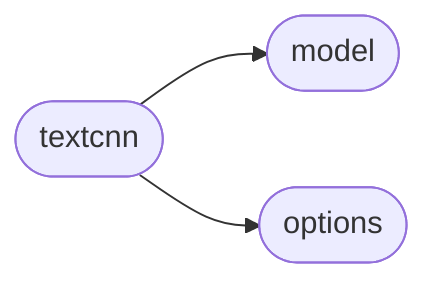
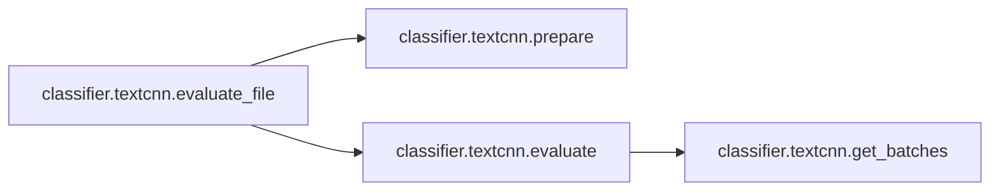

# Classifier Textcnn

[_Documentation generated by Documatic_](https://www.documatic.com)

<!---Documatic-section-Codebase Structure-start--->
## Codebase Structure

<!---Documatic-block-system_architecture-start--->

<!---Documatic-block-system_architecture-end--->

# #
<!---Documatic-section-Codebase Structure-end--->

<!---Documatic-section-classifier.textcnn.create_model-start--->
## [classifier.textcnn.create_model](3-classifier_textcnn.md#classifier.textcnn.create_model)

<!---Documatic-section-create_model-start--->


### Object Calls

* classifier.model.TextCNN

<!---Documatic-block-classifier.textcnn.create_model-start--->
<details>
	<summary><code>classifier.textcnn.create_model</code> code snippet</summary>

```python
def create_model(sess, args, vocab_size, mode=constants.TRAIN, load_pretrained_model=False, reuse=None):
    with tf.variable_scope(constants.CLS_VAR_SCOPE, reuse=reuse):
        model = TextCNN(mode, args.__dict__, vocab_size)
    if load_pretrained_model:
        try:
            model.saver.restore(sess, args.cls_model_save_dir)
            print('Loading model from', args.cls_model_save_dir)
        except Exception as e:
            model.saver.restore(sess, tf.train.latest_checkpoint(args.cls_model_save_dir))
            print('Loading model from', tf.train.latest_checkpoint(args.cls_model_save_dir))
    elif reuse is None:
        print('Creating model with new parameters.')
        sess.run(tf.global_variables_initializer())
    else:
        print('Reuse parameters.')
    return model
```
</details>
<!---Documatic-block-classifier.textcnn.create_model-end--->
<!---Documatic-section-create_model-end--->

# #
<!---Documatic-section-classifier.textcnn.create_model-end--->

<!---Documatic-section-classifier.textcnn.evaluate-start--->
## [classifier.textcnn.evaluate](3-classifier_textcnn.md#classifier.textcnn.evaluate)

<!---Documatic-section-evaluate-start--->


### Object Calls

* [classifier.textcnn.get_batches](3-classifier_textcnn.md#classifier.textcnn.get_batches)

<!---Documatic-block-classifier.textcnn.evaluate-start--->
<details>
	<summary><code>classifier.textcnn.evaluate</code> code snippet</summary>

```python
def evaluate(sess, args, vocab, model, x, y, print_logs=True):
    probs = []
    batches = get_batches(x, y, word2id=vocab, batch_size=1)
    for batch in batches:
        p = sess.run(model.probs, feed_dict={model.x: batch['x'], model.dropout: 1})
        probs += p.tolist()
    y_hat = [p > 0.5 for p in probs]
    same = [p == q for (p, q) in zip(y, y_hat)]
    if print_logs:
        print('Saving classifier result at: %s' % args.log_path)
    with open(args.log_path, 'w') as f:
        for i in range(len(y)):
            f.write('%s\t%.3f\t%s\n' % (' '.join(x[i]), probs[i], same[i]))
    return (100.0 * sum(same) / len(y), probs)
```
</details>
<!---Documatic-block-classifier.textcnn.evaluate-end--->
<!---Documatic-section-evaluate-end--->

# #
<!---Documatic-section-classifier.textcnn.evaluate-end--->

<!---Documatic-section-classifier.textcnn.get_batches-start--->
## [classifier.textcnn.get_batches](3-classifier_textcnn.md#classifier.textcnn.get_batches)

<!---Documatic-section-get_batches-start--->
<!---Documatic-block-classifier.textcnn.get_batches-start--->
<details>
	<summary><code>classifier.textcnn.get_batches</code> code snippet</summary>

```python
def get_batches(x, y, word2id, batch_size, min_len=5):
    pad = word2id[constants.PADDING_TOKEN]
    unk = word2id[constants.UNKNOWN_TOKEN]
    batches = []
    s = 0
    sen_len = []
    while s < len(x):
        t = min(s + batch_size, len(x))
        _x = []
        max_len = max([len(sent) for sent in x[s:t]])
        max_len = max(max_len, min_len)
        sen_len.append(max_len)
        for sent in x[s:t]:
            sent_id = [word2id[w] if w in word2id else unk for w in sent]
            padding = [pad] * (max_len - len(sent))
            _x.append(padding + sent_id)
        batches.append({'x': _x, 'y': y[s:t]})
        s = t
    return batches
```
</details>
<!---Documatic-block-classifier.textcnn.get_batches-end--->
<!---Documatic-section-get_batches-end--->

# #
<!---Documatic-section-classifier.textcnn.get_batches-end--->

<!---Documatic-section-classifier.textcnn.prepare-start--->
## [classifier.textcnn.prepare](3-classifier_textcnn.md#classifier.textcnn.prepare)

<!---Documatic-section-prepare-start--->
<!---Documatic-block-classifier.textcnn.prepare-start--->
<details>
	<summary><code>classifier.textcnn.prepare</code> code snippet</summary>

```python
def prepare(paths, index_list=None, is_training=False):

    def load_sent(path, max_size=-1):
        data = []
        with open(path) as f:
            for line in f:
                if len(data) == max_size:
                    break
                words = line.split()
                if is_training:
                    if len(words) > 1:
                        data.append(words)
                else:
                    data.append(words)
        return data
    if index_list is None:
        index_list = []
        for path in paths:
            i = int(re.findall('\\d', path)[-1])
            if '.tsf' in path or 'reference' in path:
                i = 1 - i
            index_list.append(i)
    data0 = load_sent(paths[0])
    if len(paths) >= 2:
        data1 = load_sent(paths[1])
        if is_training:
            min_c = min(len(data0), len(data1))
            np.random.shuffle(data0)
            np.random.shuffle(data1)
            print('Dropped: %d, %s' % (len(data0) - min_c, paths[0]))
            data0 = data0[:min_c]
            print('Dropped: %d, %s' % (len(data1) - min_c, paths[1]))
            data1 = data1[:min_c]
        x = data0 + data1
        y = [index_list[0]] * len(data0) + [index_list[1]] * len(data1)
    else:
        x = data0
        y = [index_list[0]] * len(data0)
    z = sorted(zip(x, y), key=lambda i: len(i[0]))
    return zip(*z)
```
</details>
<!---Documatic-block-classifier.textcnn.prepare-end--->
<!---Documatic-section-prepare-end--->

# #
<!---Documatic-section-classifier.textcnn.prepare-end--->

<!---Documatic-section-classifier.textcnn.evaluate_file-start--->
## [classifier.textcnn.evaluate_file](3-classifier_textcnn.md#classifier.textcnn.evaluate_file)

<!---Documatic-section-evaluate_file-start--->


### Object Calls

* [classifier.textcnn.prepare](3-classifier_textcnn.md#classifier.textcnn.prepare)
* [classifier.textcnn.evaluate](3-classifier_textcnn.md#classifier.textcnn.evaluate)

<!---Documatic-block-classifier.textcnn.evaluate_file-start--->
<details>
	<summary><code>classifier.textcnn.evaluate_file</code> code snippet</summary>

```python
def evaluate_file(sess, args, vocab, eval_model, files, index_list, print_logs=True):
    (x, y) = prepare(files, index_list=index_list)
    (acc, _) = evaluate(sess, args, vocab, eval_model, x, y, print_logs)
    return acc
```
</details>
<!---Documatic-block-classifier.textcnn.evaluate_file-end--->
<!---Documatic-section-evaluate_file-end--->

# #
<!---Documatic-section-classifier.textcnn.evaluate_file-end--->

[_Documentation generated by Documatic_](https://www.documatic.com)